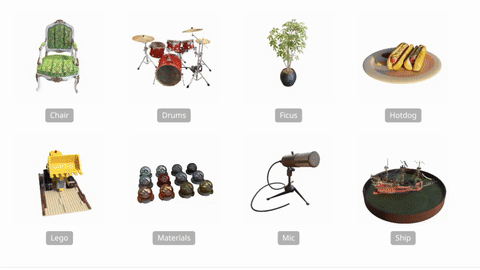

# Accelerating NeRFs: Optimizing Neural Radiance Fields with Specialized Hardware Architectures

### [Project Website](https://williamshen-nz.github.io/accelerating-nerfs/)

NeRFs are slow, we are trying to accelerate them! 🏎💨



___

## Table of Contents

- [Installation Instructions](#installation-instructions)
    - [NeRF Setup](#nerf-setup)
    - [Timeloop and Accelergy Setup](#timeloop-and-accelergy-setup)
- [Usage](#usage)
    - [Training NeRFs](#training-nerfs)
    - [Rendering NeRFs](#rendering-nerfs)
    - [Evaluating Designs](#evaluating-designs)
    - [Analysis](#analysis)
- [Tips](#tips)
    - [Profiling Rendering Code](#profiling-rendering-code)

___

## Installation Instructions

We use two separate environments for this project, one for NeRF training and rendering,
and the other for Timeloop and Accelergy.

### NeRF Setup

Use this environment for training NeRFs and rendering images. You will need a NVIDIA GPU to train and render NeRFs in
a feasible amount of time. CPU is not supported (though it may work with some modifications). The codebase was tested on
Ubuntu 20.04 with Python 3.9 and a RTX3090 running CUDA 11.7.

**Python Environment**

Create a virtual environment and install the dependencies. We suggest using conda.

```
conda create -n accelerate-nerfs python=3.8
conda activate accelerate-nerfs
pip install -r requirements.txt
```

**Download Datasets**

1. Download `nerf_synthetic.zip` from https://drive.google.com/drive/folders/128yBriW1IG_3NJ5Rp7APSTZsJqdJdfc1
2. Unzip `nerf_synthetic.zip` to the project root directory (at the level of README.md).

**Download trained checkpoints**

1. Download checkpoints from https://drive.google.com/file/d/1vw9H-5xXYr6Q_tHcpVc0Kri96i6Do4vE/view?usp=share_link
2. Unzip to the project root directory (at the level of README.md).

**Expected directory structure**

After you have downloaded the datasets and checkpoints, your directory structure should look like this:

```
accelerating-nerfs (project root)
├── accelerating_nerfs/
├── README.md
├── nerf_synthetic/
├── nerf-synthetic-checkpoints/
...
```

### Timeloop and Accelergy Setup

We use Timeloop and Accelergy to evaluate our designs. You will need to have Docker installed.
We use the provided Docker compose file to run Timeloop and Accelergy, so it's easier to set up.

```
export DOCKER_ARCH=amd64

# If you are using arm CPU (Apple M1/M2), 
# export DOCKER_ARCH=arm64 

docker-compose up
```

Open the Jupyter notebook via the URL printed in the terminal. The notebooks are located in the `notebooks` directory.

## Usage

### Training NeRFs

Use the `accelerating_nerfs/train_nerf_synthetic.py` script to train NeRFs on the NeRF synthetic dataset. Follow the
instructions in [NeRF Setup](#nerf-setup) to download the dataset. You can also download the trained checkpoints
(trained for 50k steps) using the link above.

### Rendering NeRFs

Use the `accelerating_nerfs/render_nerf_synthetic.py` script to render images from a trained NeRF. You need to have
the dataset downloaded and NeRFs trained to run this script.

### Evaluating Designs

Use the `notebooks/Profile NeRF.ipynb` notebook to evaluate designs. You need to use the Timeloop and Accelergy docker
environment to run this notebook. To do so, follow the instructions
in [Timeloop and Accelergy Setup](#timeloop-and-accelergy-setup).

You can check out the architecture designs in the `notebooks/designs` directory.

### NeRF Analysis

The analysis notebooks will save the figures to the `notebooks/figures` directory.

- NeRF Rendering Time Breakdown
    1. Run the `accelerating_nerfs/render_nerf_synthetic.py` script
    2. Process results in `notebooks/Time Breakdown.ipynb` notebook
- NeRF Input Activation Sparsity (activations are sparse)
    1. Run the `accelerating_nerfs/nerf_activation_sparsity.py` script (this adds hooks to the FC layers)
    2. Process results in `notebooks/NeRF Activation Sparsity.ipynb` notebook
- NeRF MLP Weight Sparsity (we find that the weights are **not** sparse)
    1. Run the `notebooks/NeRF Weight Sparsity.ipynb` notebook, which loads checkpoints and checks the sparsity of the
       weights.
- NeRF Volumetric Rendering Weight Sparsity (weights are somewhat sparse)
    1. Run the `accelerating_nerfs/nerf_volrend_sparsity.py` script
    2. Process results in `notebooks/NeRF Volumetric Rendering Sparsity.ipynb` notebook

## Tips

### Profiling Rendering Code

1. Set `CUDA_LAUNCH_BLOCKING=1` to force CPU-GPU synchronization.
2. Run the `accelerating_nerfs/render_nerf_synthetic.py` script with `profile=True`
3. Check the resulting `.pstat` file for profiling results, I recommend using Snakeviz for visualization
   (you can pip install it, `snakeviz profile.pstat`)

If you're using PyCharm, it's suggested to use the `line_profiler_pycharm` package and plugin to profile.

## Acknowledgements

Our codebase uses the [nerfacc](https://github.com/KAIR-BAIR/nerfacc/) project to speed up NeRF training and rendering.